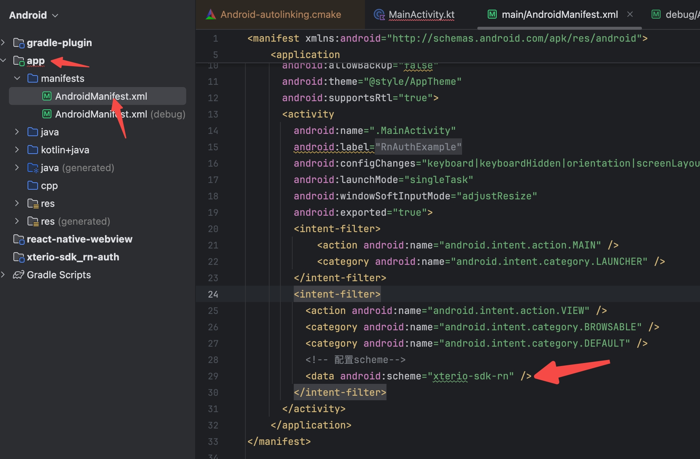

# @xterio-sdk/rn-auth

xterio auth service in react native

## Installation

```sh
npm install @xterio-sdk/rn-auth

# only ios
npx pod-install
# 或
cd ios && pod install && cd ..
```

## Usage

```tsx
import {
  Env,
  LoginType,
  PageType,
  useXterioAuthContext,
  XterioAuthProvider,
  type IXterioAuthContextProps
} from '@xterio-sdk/rn-auth'
// ...

//1. Initialize
export default function Root() {
  const config: IXterioAuthContextProps = {
    app_id: '',
    client_id: '',
    client_secret: '',
    //the scheme
    redirect_uri: 'xterio-sdk-rn://auth',
    env: Env.Dev
  }
  return (
    <XterioAuthProvider {...config}>
      <Example />
    </XterioAuthProvider>
  )
}

// 2.Use
const Example = () => {
  const { login, logout, openPage, getPageUrl, loginMethod, loginWalletAddress, isLogin, userinfo } =
    useXterioAuthContext()

  const _ssoLogin = useCallback(() => {
    login(LoginType.Email)
  }, [login])

  const _openPage = useCallback(() => {
    openPage(PageType.nft_market)
  }, [openPage])

  const _getPageUrl = useCallback(() => {
    console.log('the page uri=', getPageUrl(PageType.nft_market))
  }, [getPageUrl])

  return (
    <View style={styles.container}>
      <Text>isLogin: {isLogin}</Text>
      <Text>userinfo: {JSON.stringify(userinfo)}</Text>
      <Text>loginMethod: {loginMethod}</Text>
      <Text>loginWalletAddress: {loginWalletAddress}</Text>
      <Button title="Login" onPress={_ssoLogin} />
      <Button title="Logout" onPress={logout} />
      <Button title="OpenPage" onPress={_openPage} />
      <Button title="GetPageUrl" onPress={_getPageUrl} />
    </View>
  )
}
```

## Configuration

### iOS


### Android




## API Reference

### `XterioAuthProvider`
the auth context
```tsx
<XterioAuthProvider app_id='' client_id='' client_secret='' env='' redirect_uri=''></XterioAuthProvider>
```

### `useXterioAuthContext()`

#### `userinfo`

#### `isLogin`
whether to log in

#### `loginMethod`
get user logined method

#### `loginWalletAddress`
get user logined wallet address

#### `login(mode?:LoginType)`

#### `logout()`

#### `openPage(page:PageType, options?:PageOptionParam)`

#### `getPageUrl(page:PageType, options?:PageOptionParam)`

#### `getIdToken():Promise<string>`
check whether the idToken is valid. If the idToken is invalid, empty string is returned, else the non-empty str.

#### `getOtac():Promise<string>`


## Interface/Type

### `Env` <a id="Env"></a>
```ts
export enum Env {
  Dev = 'Dev',
  Staging = 'Staging',
  Production = 'Production'
}
```

### `IXterioAuthContextProps`
```ts
export interface IXterioAuthContextProps extends Partial<ISSoTokensParams> {
  env?: Env
}
export interface ISSoTokensParams {
  app_id: string
  client_id: string
  client_secret: string
  redirect_uri: string
  response_type: string //value: 'code'
  scope: string //value: 'all'
  mode: 'default' | 'email' //default: 'default'
  grant_type: string //value: 'authorization_code'
  logout?: '0' | '1' //default: '1'
  logLevel?: number //default: 1
}
```

### `LoginType`
```ts
export enum LoginType {
  Default = 'default',
  Email = 'email',
  Mini = 'mini'
}
```

### `LoginMethodType`
```ts
export enum LoginMethodType {
  Email = 'email', //email
  Teleg = 'Telegram', //tg

  //wallet way
  METAMASK = 'METAMASK',
  // COINBASE = 'COINBASE',
  WALLETCONNECT = 'WALLET CONNECT',
  TRUST = 'TRUST',
  SAFEPAL = 'SAFEPAL',
  // OKX = "OKX",
  BINANCE = 'BINANCE',
  BYBIT = 'BYBIT',

  //social way
  Google = 'google',
  Facebook = 'facebook',
  Discord = 'discord',
  Twitter = 'twitterv2'
}
```

### `PageType`
```ts
export enum PageType {
  asset = 'asset',
  nft_market = 'nft_marketplace',
  nft_collection = 'nft_collection',
  setting = 'setting'
}
```

### `PageOptionParam`
```ts
export interface PageOptionParam {
  /** only settings page */
  tab?: 'profile' | 'account' | 'wallet' | 'security'
  /** only asset page */
  active?: 'ingame' | 'onchain'
  /** only nft market page */
  keyword?: string
  /** only nft page, required when nft_collection */
  collection?: string
  /** only nft page */
  features?: { k: string; initValues: (number | string)[]; type?: string }[]
  /** set xterio page layout options */
  XterViewCustomOptions?: Partial<XterViewCustomizeOptions>
}
export type BooleanOrBinary = boolean | 1 | 0
export interface XterViewCustomizeOptions {
  /** whether hide wallet entry */
  hide_wallet_entrance?: BooleanOrBinary
  /** whether hide account */
  hide_account_entrance?: BooleanOrBinary
  /** whether hide menu, only h5 usage */
  hide_menu_entrance?: BooleanOrBinary
  /** whether hide logout btn */
  hide_sign_out?: BooleanOrBinary
  /** whether hide header */
  hide_header?: BooleanOrBinary
  /** whether hide footer */
  hide_footer?: BooleanOrBinary
  /** whether disable logo click event */
  disable_logo_click?: BooleanOrBinary
  /** whether hide game select, only asset page */
  hide_game_select?: BooleanOrBinary
  /** whether hide game tokens, only asset page */
  hide_game_tokens?: BooleanOrBinary
  /** whether hide game filter, only nft page */
  hide_game_filter?: BooleanOrBinary
}
```


## Contributing

See the [contributing guide](CONTRIBUTING.md) to learn how to contribute to the repository and the development workflow.

## License

MIT

---

Made with [create-react-native-library](https://github.com/callstack/react-native-builder-bob)
