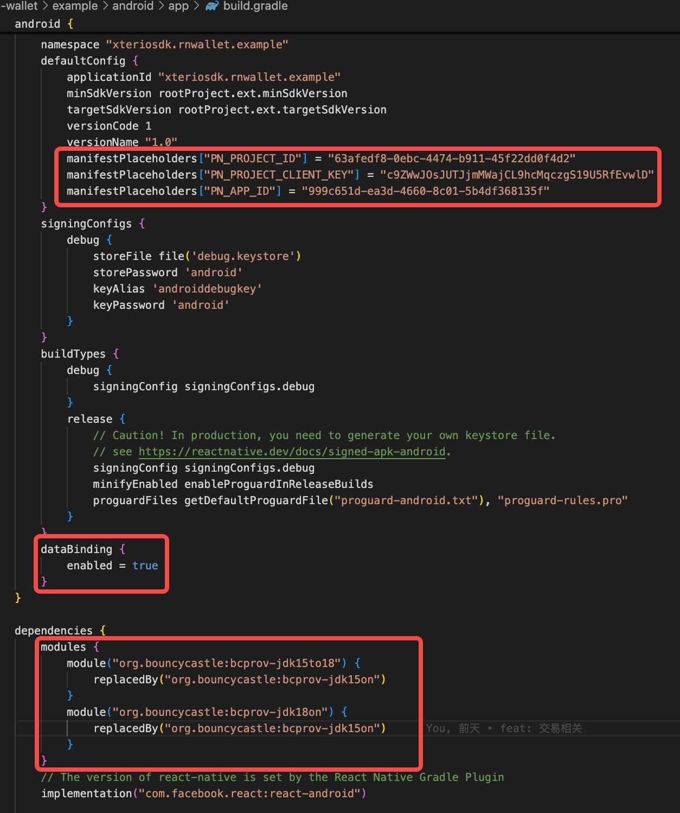

# @xterio-sdk/rn-wallet

xterio wallet service in react native

## Installation

```sh
npm install @xterio-sdk/rn-wallet @xterio-sdk/rn-auth

# only ios
npx pod-install
# 或
cd ios && pod install && cd ..
```

## Usage

```tsx
import {
  SendTransactionMode,
  useXterioTransaction,
  useXterioWalletContext,
  XterioWalletProvider,
  IXterioWalletContextProps
} from '@xterio-sdk/rn-wallet';
// ...

//provider setup
const options:IXterioWalletContextProps = {
  env: Env.Dev,
  transactionMode:SendTransactionMode.Gasless,
}

<XterioWalletProvider {...options}>
  <AppView />
</XterioWalletProvider>

//useXterioWalletContext(), useXterioTransaction()
const {
  connectWallet,
  disconnectWallet,
  obtainWallet,
  switchChain,
  openWallet,
  signMessage,
  isConnect,
  aaAddress
} = useXterioWalletContext();

const { sendTransaction, sendUserOperation, state } = useXterioTransaction(erc20,'transfer');

```

## Configuration

> There are two methods for automatic linking of the `ParticlenNetwork` series modules. 
> 
> One is to find the project `react-native.config.js` file and add the `dependencies` configuration item as follows; 
> 
> the other is to directly install the corresponding module. `npm install @particle-network/rn-base@2.0.6 @particle-network/rn-auth-core@2.0.6 @particle-network/rn-aa@2.0.6`.
>

```js
//...
dependencies: {
  //...
  '@particle-network/rn-base': {},
  '@particle-network/rn-auth-core': {},
  '@particle-network/rn-aa': {},
  //...
},
```

### iOS
At the root of your Xcode project, create a new file, `ParticleNetwork-Info.plist`. Ensure this is marked under “Target Membership.”

From here, with a fresh `ParticleNetwork-Info.plist` file, go ahead and fill it in with the following:

```js
<?xml version="1.0" encoding="UTF-8"?>
<!DOCTYPE plist PUBLIC "-//Apple//DTD PLIST 1.0//EN" "http://www.apple.com/DTDs/PropertyList-1.0.dtd">
<plist version="1.0">
<dict>
	<key>PROJECT_UUID</key>
	<string>YOUR_PROJECT_UUID</string>
	<key>PROJECT_CLIENT_KEY</key>
	<string>YOUR_PROJECT_CLIENT_KEY</string>
	<key>PROJECT_APP_UUID</key>
	<string>YOUR_PROJECT_APP_UUID</string>
</dict>
</plist>

```

Finally, you’ll need to edit your Podfile to align with the snippet below; this is required for all iOS projects that leverage Particle Auth Core.


### Android

If you’re planning on using Android for your React Native application, ensure you meet the following prerequisites (otherwise, expect issues or non-functionality):



## API Reference

### `XterioWalletProvider`

the wallet context

```tsx
<XterioWalletProvider transactionMode={} PN_CHAIN_ID={} PN_PROJECT_ID={} PN_CLIENT_KEY={} PN_APP_ID={}>
  <AppView />
</XterioWalletProvider>
```

### `useXterioWalletContext()`

#### `aaAddress`
xterio user aa wallet address

#### `isConnect`
aa wallet connection status

#### `connectWallet(chainId?:number): Promise<void>`

#### `disconnectWallet(): Promise<void>`

#### `obtainWallet(): Promise<void>`

#### `switchChain(chainId:number): Promise<void>`

#### `signMessage(message: string, uniq?: boolean) :Promise<string>`

### `useXterioTransaction(contract?, funcName?)`

#### `state`
transaction status

#### `sendTransaction(...args:any[], tx?:TransactionParam)`
send a transaction

```ts
await sendTransaction?.(toAddr, amount, {value:'', gasLimit:''})
```

#### `sendUserOperation(tx: TransactionParam|TransactionParam[])`
send a transaction

```ts
await sendUserOperation?.({to:'', data:''})
```

## Contributing

See the [contributing guide](CONTRIBUTING.md) to learn how to contribute to the repository and the development workflow.

## License

MIT

---

Made with [create-react-native-library](https://github.com/callstack/react-native-builder-bob)
